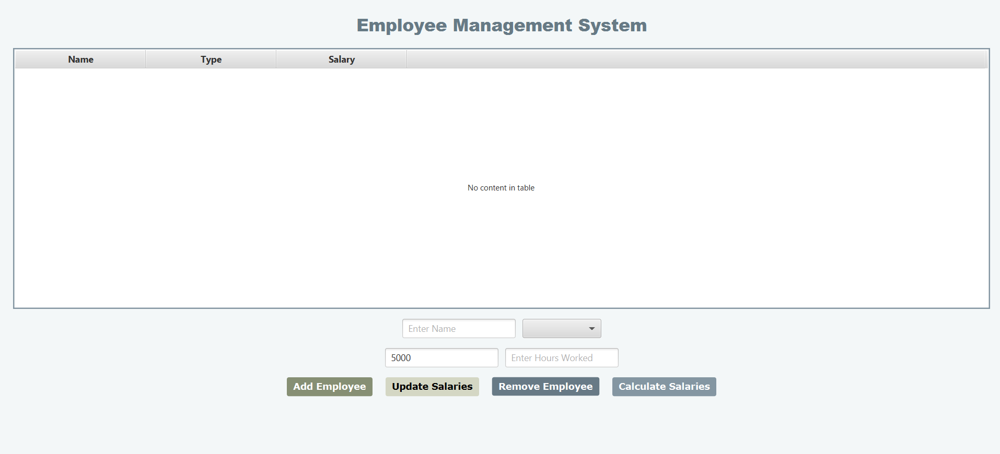
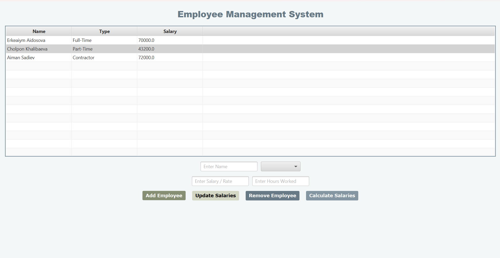

### Employee Management System Documentation
## Project Overview
The Employee Management System is a desktop application built using JavaFX. 
It allows users to manage employees of different types, calculate their salaries, update salary information, and remove employees.
The system uses object-oriented programming principles, ensuring modularity and reusability of code.

## The application is designed with an easy-to-use interface where users can:

- Add employees with specific details.
- Calculate individual or total salaries.
- Update employee salary information.
- Remove employees from the list.
- How the Application Works
  
## Main Window:

The interface displays a table with three columns:

Name: Employee's full name.
Type: The type of employee (Full-Time, Part-Time, or Contractor).
Salary: Calculated salary based on employee type.
Below the table are input fields and control buttons.
Control Buttons:

## Add Employee:
Adds a new employee to the system.
Requires:

# Name.
*Type of employee (Full-Time, Part-Time, Contractor).*
*Salary or hourly rate.*
*Hours worked (if applicable).*

## Update Salaries:
Recalculates salaries for all employees in the list based on the provided details.

## Remove Employee:
Deletes the selected employee from the table.

## Calculate Salaries:
Displays the total sum of salaries for all employees in a pop-up dialog.
Instructions to Run the Application

### Prerequisites:

Install Java JDK 8 or higher.
Install JavaFX SDK.

### Steps to Run:

Download the project and import it into an IDE like IntelliJ IDEA or Eclipse.
Run the HelloApplication.java file to launch the application.
The main interface will load, displaying the empty table and controls.
User Guide
Step-by-Step Instructions
## Adding Employees:

Enter the employee’s name in the Enter Name field.
Select the type of employee from the drop-down menu.
Enter the salary or hourly rate in the Enter Salary / Rate field.
For Part-Time and Contractor employees, enter the hours worked in the Enter Hours Worked field.
Click the Add Employee button. The employee will appear in the table with their calculated salary.
## Updating Salaries:

Click the Update Salaries button. This will recalculate salaries for all employees in the list based on the current details.
Calculating Total Salaries:

Click the Calculate Salaries button. A pop-up will display the total salaries of all employees.
## Removing Employees:

Select an employee from the table by clicking on their row.
Click the Remove Employee button to delete them from the list.
Sample Inputs

## Full-Time Employee:
Name: Erkeaiym Aidosova
Type: Full-Time
Salary: 70000
Hours Worked: Not required.
## Part-Time Employee:
Name: Cholpon Khalibaeva
Type: Part-Time
Hourly Rate: 20
Hours Worked: 216 (Results in 4320 salary).
## Contractor:
Name: Aiman Sadiev
Type: Contractor
Hourly Rate: 50
Hours Worked: 150 (Salary capped at max hours allowed).

### Screenshots
# 1. Initial Screen
The application starts with an empty table and input fields.

# 2. Adding Employees
After entering employee details and clicking Add Employee, the table is updated with calculated salaries.

# 3. Calculating Total Salaries
Clicking Calculate Salaries shows a pop-up with the total salary of all employees.

# 4. Removing an Employee
Selecting a row and clicking Remove Employee deletes the entry from the table.

Purpose of the Project
The goal of this project is to provide an efficient system for managing employees and calculating their salaries based on their employment type. It demonstrates:

The practical use of object-oriented programming (OOP).
JavaFX for building interactive GUIs.
The implementation of inheritance and polymorphism in a real-world scenario.

